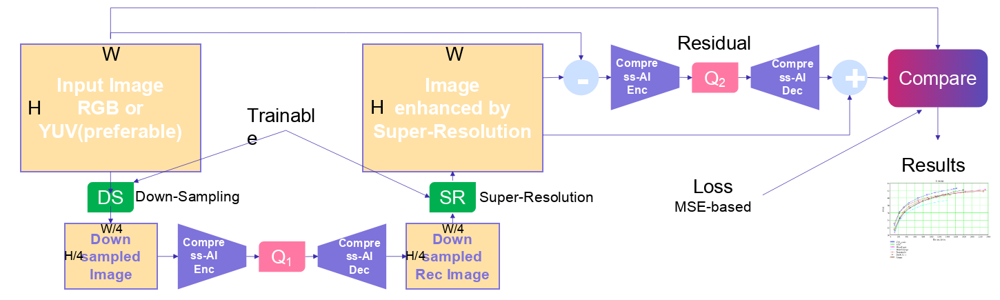

# Tech task for Mark Mirgaleev

### Train the super resolution (SR) model with the VAE:

1. Take `compress-ai` code from Github (https://github.com/InterDigitalInc/CompressAI)
2. Install all dependencies (See README)
3. Use any free dataset.
4. Use model [`mbt2018-mean`](https://interdigitalinc.github.io/CompressAI/zoo.html#mbt2018-mean) 
    * Use any checkpoint number (1-4)
5. With selected model checkpoint from `4`, train, validate and test SR model (see scheme)
    * Q1 and Q2 corresponded lambda could be different (use lambda from [link](https://interdigitalinc.github.io/CompressAI/zoo.html#training))

6. Prepare presentation of results:
    1. Description of models, checkpoints, pipelines.
    2. Train logs -> train charts. 
    3. Example of usage, images, metrics results. 
    4. Use JPEG (Quality 70, 80, 90, 95), One selected Checkpoint of baseline Compress-AI model (from 4)) and your SR model.
    5. Plot results – required.
    6. Conclusions.

